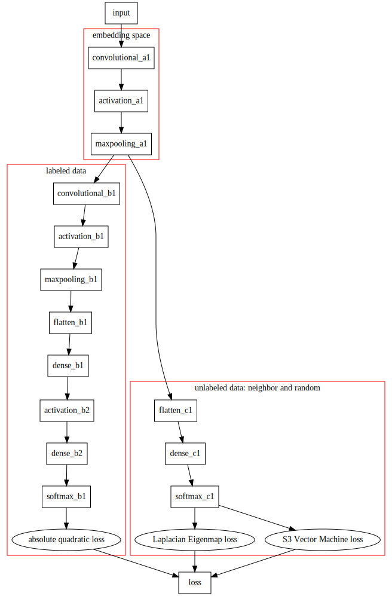

# README

## PAPER
This is the implementation of this paper:
[Deep Learning via Semi-supervised Embedding](http://www.thespermwhale.com/jaseweston/papers/deep_embed.pdf) by Jason Weston

## Remote Data Description

    >>> x = sio.loadmat('PaviaU.mat')
    >>> x.keys()
    dict_keys(['paviaU', '__globals__', '__header__', '__version__'])
    >>> x['paviaU'].shape
    (610, 340, 103)
    >>> x['paviaU'][0]
    array([[ 647,  499,  464, ..., 3221, 3238, 3250],
        [ 604,  546,  527, ..., 2442, 2464, 2528],
        [ 621,  746,  556, ..., 2308, 2345, 2361],
        ..., 
        [ 524,  525,  598, ..., 2936, 2940, 2950],
        [ 528,  330,   70, ..., 2737, 2774, 2829],
        [ 711,  483,  423, ..., 2562, 2539, 2488]], dtype=uint16)

    >>> x = sio.loadmat('PaviaU_gt.mat')
    >>> x.keys()
    dict_keys(['__header__', '__version__', '__globals__', 'paviaU_gt'])
    >>> x['paviaU_gt'].shape
    (610, 340)
    >>> x['paviaU_gt']
    array([[0, 0, 0, ..., 0, 0, 0],
        [0, 0, 0, ..., 0, 0, 0],
        [0, 0, 0, ..., 0, 0, 0],
        ..., 
        [2, 2, 2, ..., 0, 0, 0],
        [2, 2, 2, ..., 0, 0, 0],
        [2, 2, 2, ..., 0, 0, 0]], dtype=uint8)

Read the [pdf problem collection](./Semi-supervised_Embedding_Collection.pdf) generated by [classeur](https://app.classeur.io).

# Semi-supervised Experiment Problem Collection

## Deep Learning via Embedding Model

### Describe Dataset in JSON
It's very annoying to adapt the model for new dataset when code lines like filename and `tf.placeholder` shape have to be modified every time. So writing `json` configuration file would be a better idea than changing the code mannually in source code or command line input.

### Blind To Classifications
Try normalization anyway:

    from sklearn import preprocessing
    fn = '/home/yangminz/Semi-supervised_Embedding/dataset/PaviaU.mat'
    dset = sio.loadmat(fn)
    x = dset['paviaU'].reshape(shape_[0]*shape_[1], shape_[2])
    x = preprocessing.scale(x)
    x = x.reshape(shape_)

### Taxing Coumputation
A profusion of computation lies in *finding neighbors*, or $\mathbf{W_{ij}}$. It's not cheap at all because it involves distance computation and ording:

$$ \sqrt{ (\mathbf{x_1} - \mathbf{x_2})^T (\mathbf{x_1} - \mathbf{x_2}) } $$

$\mathbf{W_{ij}}$ is crucial to manifold or graph method since it indicates the internel structure or *space distribution* of the dataset.

The paper [Deep Learning via Semi-supervised Embedding](https://ronan.collobert.com/pub/matos/2008_deep_icml.pdf) provides the solution or substitution for such arduous computation in section *3.1 Labeling Unlabeled Data as Neighbors(Building the Graph)*:

> However, there are also many other ways of collecting neighboring unlabeled
data that do not involve computing $k$-nn. For example, if one has access to
unlabeled sequence data the following tricks can be used.

The trick is to take advantage of the physical properties of data itself. Here for `paviaU` dataset, we pick the actual neighbor of a 'pixel' as its neighbor. Without distance computation and ordering, the computation is much faster.

According to the paper, the tricks can be subsumed into the following conditions by their datasets:

- image
- text
- speech

### Difficult to Perform Batch Computation for Loss
To impletement loss with unlabeled samples, it's import to combine supervised loss with embedding loss. One can consult this [stackoverflow post](http://stackoverflow.com/questions/37479119/doing-pairwise-distance-computation-with-tensorflow?newreg=8d7e71d8d8a34499ab8d6d6a23aa9dad) to figure out how to impletement embedding loss with unlabeled samples. There are some tricks for $\mathbf{W_{ij}}$.

Notice that it is difficult to impletement this embedding loss within a batch. Because a batch of data in `tf.placeholder` cannot get $\mathbf{W_{ij}}$ with each other. If we have a batch in size 3 like `[x[0], x[1], x[2]]`, then we must do something like:

	for i in [0, 1, 2]:
		for j in [0, 1, 2]:
			W[i][j] = get_weight(x, i, j)

But as far as I know, it seems that this is impossible to impletement with `Tensorflow` because it requires indexing within `tf.placeholder`.

Fortunately the algoritm in the paper actually did not impletement batch form like:

$$ \sum_{i=1} l (f(x_i), y_i) + \lambda \sum_{i,j=1}^{M+U} L(f(x_i),f(x_j), W_{ij}) $$

Instead, it picks a pair of labeled, random neighbor, random unlabeled at every epoch. This makes it much more easier to impletement. It sounds like not fast. But with the new design of neighboring, the computation is not slow at all.

And remember to make the loss to scalar by `tf.reduce_sum` or `tf.reduce_mean`.

### Weight Reusing
Originally, the code was designed like:

    def forward(x):
        y = Dense(128, activation='tanh')(x)
        y = Dense(1, activation='sigmoid')(y)
        return y

    y1 = forward(x1)
    y2 = forward(x2)

However, weights would not be reused in this way because everytime the script calls `forward`, a new layer would be allocated when building up the graph. As a result, we get 2 seperate networks. 

Layer initialization should be put outside the function:

	layers = [
        Dense(128, activation='tanh'),
        Dense(1, activation='sigmoid')]
	
	def forward(x):
		y = x
		for layer in layers:
			y = layer(y)
	
	y1 = forward(x1)
	y2 = forward(x2)

It's much more convinent since the structure of the network can easily be adjusted and extended in `list` like:

	layer_3 = layer_1[:5] + layer_2[4:]

Such implemention is possible by `Keras`.

### Distance and `nan` Problem
In EmbedNN experiment with `g50c` dataset, the model sometimes converges to `nan` when use different distance in unlabeled embedding. For *Laplacian Eigenmaps*, 

$$ \sum_{ij} L(f_i, f_j, W_{ij}) = \sum_{ij} W_{ij} ||f_i - f_j||^2 $$

can work while Euclidean distance:

$$ \sum_{ij} L(f_i, f_j, W_{ij}) = \sum_{ij} W_{ij} ||f_i - f_j|| $$

would give `nan`. There seems some delicate math backend.

And *Siamese Networks* embedding function:

$$ L(f_i, f_j , W_{ij}) = \max(0, m− ||f_i − f_j||_2)^2,  \text{ if } W_{ij} = 0 $$

can work when $||f_i − f_j||_2 = (f_i - f_j)^T(f_i - f_j)$ while simple Euclidean distance would not give meaningful results.

### S3VM loss
Standard optimization for *S3VM* is:

$$ \sum_{\text{labeled}} \max(0, 1 - y_i f(x_i)) + \lambda_1 + ||h||^2_{\mathcal{HK}} + \lambda_2 \sum_{\text{unlabeled}}\max(0, 1 - |f(x_i)|)$$

Here we use the final unlabeled term in the combined loss which contains neighbor embedding loss based on manifold(graph) and this *S3VM* loss:

$$L_{\text{supervised}} + \alpha L_{\text{manifold}} + \beta L_{\text{cluster}}$$ 

Note that here $\beta +\alpha=1$ and $f$ is not the *SVM* kernel in original model but deep neural network embedding here.

A little experiment here can detect the model preference between $ L_{\text{neighbor}}$ and $L_{\text{s3vm}}$. Iterate `100000` labeled data with absolute hinge loss and *Siamese Networks* embedding:

| Alpha    | 0.0    | 1.0    | 0.9    | 0.8    | 0.7    | 0.6    | 0.5    | 0.4    | 0.3    | 0.2    | 0.1    | 0.0    |
|----------|--------|--------|--------|--------|--------|--------|--------|--------|--------|--------|--------|--------|
| Beta     | 0.0    | 0.0    | 0.1    | 0.2    | 0.3    | 0.4    | 0.5    | 0.6    | 0.7    | 0.8    | 0.9    | 1.0    |
| Accuracy | 66.08% | 39.16% | 36.64% | 45.52% | 14.35% | 48.74% | 41.80% | 41.46% | 51.82% | 56.18% | 63.75% | 66.14% |

### Correct Distinguishing, Error Labeling
The classifier can distinguish classes from each other. However, the corresponding labels are misclassified. For example, `[2, 2, 4, 3, 3]` would be classified as `[1, 1, 6, 2, 2]`. They are correctly distinguished but wrongly classified. 

The test data is the one to blame. One should be extremly careful when prepare "one-hot" labeling otherwise such weird error would occur. 

For example, the following function

    def OneHot(data, width):
        tmp = np.zeros((data.size, width))
        tmp[np.arange(data.size), data] = 1
        return tmp
   
  returns one at their indices, `[0, 1, 0, 0]` for `data=1` and `width=4`. Sometimes similar function would give one-hot at their counting position, `[1, 0, 0, 0]`. Here `data=1` means *the first digit* rather than index `1`.

### Improve the Accuracy
Tested with `paviaU`.

- Change Embedding Algorithm
*Lapalacian Eigenmaps* seems to work better than *Siamese Networks*:

| nb_labeled | supervised  | manifold | Alpha | cluster | Beta | Radius | Accuracy |
|------------|-------------|----------|-------|---------|------|--------|----------|
| 100000     | 'abs_hinge' | 'SN'     | 0.5   | 'S3VM'  | 0.5  | 1      | 41.80%   |
| 100000     | 'abs_hinge' | 'LE'     | 0.5   | 'S3VM'  | 0.5  | 1      | 65.52%   |

- Absolute Quadratic Loss
Use absolute quadratic loss may be better for labeled data:

$$ \mathcal{L}(y, y_t) = \max(0, 1 - |y_t \cdot y|)^2 $$

| nb_labeled | supervised      | manifold | Alpha | cluster | Beta | Radius | Accuracy |
|------------|-----------------|----------|-------|---------|------|--------|----------|
| 100000     | 'abs_hinge'     | 'LE'     | 0.5   | 'S3VM'  | 0.5  | 1      | 65.52%   |
| 100000     | 'abs_quadratic' | 'LE'     | 0.5   | 'S3VM'  | 0.5  | 1      | 69.93%   |

- Neighbor Radius
For manifold(graph) loss, appropriate neighbor radius may help the accuracy(to avoid overfitting). But in fact this does not help: 

| nb_labeled | supervised      | manifold | Alpha | cluster | Beta | Radius | Accuracy |
|------------|-----------------|----------|-------|---------|------|--------|----------|
| 100000     | 'abs_quadratic' | 'LE'     | 0.5   | 'S3VM'  | 0.5  | 1      | 69.93%   |
| 100000     | 'abs_quadratic' | 'LE'     | 0.5   | 'S3VM'  | 0.5  | 2      | 67.34%   |
| 100000     | 'abs_quadratic' | 'LE'     | 0.5   | 'S3VM'  | 0.5  | 3      | 62.05%   |

- Other Model Structure
Try *Auxiliary EmbedCNN*:

This model gives a relatively high accuracy with `100000` labeled data, `'abs_quadratic'` supervised loss and `'S3VM'` unsupervised loss:

| Alpha    | 0.0    | 1.0    | 0.9    | 0.8    | 0.7    | 0.6    | 0.5    | 0.4    | 0.3    | 0.2    | 0.1    | 0.0    |
|----------|--------|--------|--------|--------|--------|--------|--------|--------|--------|--------|--------|--------|
| Beta     | 0.0    | 0.0    | 0.1    | 0.2    | 0.3    | 0.4    | 0.5    | 0.6    | 0.7    | 0.8    | 0.9    | 1.0    |
| Accuracy | 68.10% | 58.66% | 62.87% | 63.00% | 62.16% | 69.43% | 69.58% | 70.43% | 71.62% | 74.18% | 77.37% | 68.17% |

But it does not mean the more intricate the architecture is, the higher the accuracy will be. If the auxiliary net for unsupervised data is another stack of convolutional and maxpooling layers, the accuracy can decrease.

## Other Models

### Semi-supervised Support Vector Machine: Memory Error
*SVM* would take a lot of memory, e.g. $O(n^2)$ for kernel. Thus to run *S3VM*, the size of dataset should not be large. *SVM* is especially useful when the number of data is not so big, otherwise other brute algorithm would also work well, which makes *SVM* algorithm less competitive. So try less data to fit *S3VM* unless you have very large memory.

It's better to be noticed that currently it is not easy at all to find a repository for *multi-classification semi-supervised SVM*. The most common code is *multi-classification SVM* or *binary S3VM*.

### Discriminative Restricted Boltzmann Machine
*Semi-supervised DRBM* algorithm is proposed in paper [Classification using Discriminative Restricted Boltzmann Machines](http://www.cs.toronto.edu/~larocheh/publications/drbm-mitacs-poster.pdf):

$$ \mathcal{L}_{\text{semi−sup}} (\mathcal{D}_{\text{train}} , \mathcal{D}_{\text{unlab}}) = \mathcal{L}_{\text{TYPE}}(\mathcal{D}_{\text{train}}) + \beta \mathcal{L}_{\text{unsup}} (\mathcal{D}_{\text{unlab}}) $$

$$ = -\sum_{i=1}^{|\mathcal{D}_{\text{train}}|} \log p(y_i | \mathbf{x_i}) - \beta \sum_{i=1}^{|\mathcal{D}_{\text{unlab}}|} \log p(\mathbf{x_i}) $$

or 

$$ = -\sum_{i=1}^{|\mathcal{D}_{\text{train}}|} \log p(y_i | \mathbf{x_i}) -\alpha \sum_{i=1}^{|\mathcal{D}_{\text{train}}|} \log p(y_i , \mathbf{x_i}) - \beta \sum_{i=1}^{|\mathcal{D}_{\text{unlab}}|} \log p(\mathbf{x_i}) $$

The implementation of *semi-supervised DRBM* consulted other people's code. The most common repository is *RBM*. I only found two repositories implemented by `Tensorflow` or `Theano`, both of them are supervised only.

The extension to semi-supervised is not difficult, as long as one pay attention to the *contrastive divergence algorithm*. The following code would illustrate:

    def _calc_unsupervised_grads(self, x):
        x0, h0, x1, h1 = self._gibbs_un_sampling_step(x)

        h0 = tf.reshape(h0, [-1, self.num_hidden, 1])
        x0 = tf.reshape(x0, [-1, self.num_visible, 1])
        h1 = tf.reshape(h1, [-1, self.num_hidden, 1])
        x1 = tf.reshape(x1, [-1, self.num_visible, 1])

        # no gradient for U, but use zero to take place here
        d_U_unsup = tf.constant(0.0)
        d_W_unsup = tf.reduce_mean(tf.matmul(h0, x0, transpose_b=True) - tf.matmul(h1, x1, transpose_b=True), 0)

        d_b_unsup = tf.reduce_sum(x0 - x1, 0)
        d_c_unsup = tf.reduce_sum(h0 - h1, 0)
        d_d_unsup = tf.constant(0.0)
        return d_U_unsup, d_W_unsup, d_b_unsup, d_c_unsup, d_d_unsup

We know that the difference between supervised and semi-supervised is one-hot label `y`. Thus make the gradients related to `y` be `tf.constant(0.0)` would make them contribute nothing to the loss. Meanwhile `Tensorflow` can work even we have no method to figure out the shape of the `tf.placeholder` batch.

### All-0 Prediction
Sometimes the model would predict the same label(`0` for dataset of `[0, 1, 2, 3, 4]` for example) in `EmbedCNN` and `Ladder Network(LN)`.

#### For EmbedCNN
The problem for EmbedCNN can usually be solved by:

- Try different initializers. Replace the default initializer with `lecun_uniform` for example.

- Clip gradient. Limit the gradient so they won't go to infinite. Code is usually like:

	    opt = tf.train.AdagradOptimizer(lr)
	    gvs = opt.compute_gradients(loss_)
	    clipped_gvs = [(tf.clip_by_value(grad, -1.0, 1.0), var) for grad, var in gvs]
	    train_step = opt.apply_gradients(clipped_gvs)

- Use different activations. For example, use `tanh` and `sigmoid` instead of using `relu` only.

- Sometimes directly use a 2-layer `dense` network would give a good result.

- Add `Dropout` layer to the network.

#### For LN
The major problem is `houston` dataset. It's weird because the LN with the same architecture works well on `paviaU` and `indian`. But for `houston`, the prediction will be `[0, 0, 0, ..., 0]`. A little debug tip here:

- Run the model in very short time(10 epoches for example) first and print all predicted labels. In this way, one can save a lot of time to verify if his model works before entering the time-costing training. 

- Make sure that training dataset is reasonable. The split of labeled and unlabeled training data should reasonable: each class should at least have a certain and balanced number of data.

- Transform dataset. Shuffle, crop or PCA the true dataset and then train it to see if model can make multi-label prediction. If the model still make prediction like `[0, ..., 0]`, there must be something wrong with the dataset instead of the model.

- Remove the predicted class. If the model always predict `2` for dataset with `[0, 1, 2, 3, 4]`, try remove the `2` data and train with `[0, 1, 3, 4]` to see if the model still only predict `2`. 

- Check the weights and layer output. Check weights after training to see if it is the weights that cause the problem. Especially the weight of the last layer.

Then we can finally locate the problem is weight and loss become `nan` in training. This problem is most probably caused by infinite gradient or loss. Thus clip it would make the situation much better. 

However, one may find that Tensorflow's `clip_by_value` would give errors. This is mainly because the gradient itself is `nan` and loss is `inf`. Here in `houston` dataset, when the labeled loss is around 2.5, the unlabeled loss is 3000, 5000, inf.

This problem can be traced back to the selection of unlabeled data instead of the architecture of the network, if one break at the batch input code line to check. There are so many duplicated unlabeled data. This will not affect EmbedCNN since it picks only one unlabeled sample at a time, but will greatly influence LN. 

Now can check if it is the unlabeled data unshuffled. Because if not shuffled, the data in batch would be very similar or even the same arccording to the physical properties of dataset. The problem can be solved by shuffling.

### Improve Ladder Networks, Houston

The original loss in the paper [Semi-Supervised Learning with Ladder Network](https://arxiv.org/abs/1507.02672) is:

$$ C = C_{\text{supervised cost}} + C_{\text{unsupervised denosing cost}} $$

Give the unsupervised part a coefficient `alpha < 1.0` so that the unstructured unlabeled part would not strongly affect the labeled one:

$$ C = C_{\text{supervised cost}} + \alpha C_{\text{unsupervised denosing cost}} $$

## Writing

We implement three models of deep learning via semi-supervised embedding for paivaU, indian and Houston datasets. For comparision purposes, we also provide the performance of label spreading model and ladder networks. 

In the semi-supervised embedding experiment, we define the deep learning model with convolutional neural network. For output model, both labeled and unlabeled data are processed by convolutional and maxpooling layers with a window of size 2. The number of filters is {32, 16}. Then we use a two-layer neural network for classification with {64, 128} hidden neurons. The total loss is computed by absolute quadratic and Laplacian Eigenmap combined with unlabeled loss of S3VM respectively. There is a balance inside the unsupervised loss between embedding algorithm and S3VM loss. We find that the task prefers S3VM loss to embedding algorithm. According to the ressult, a combination of 0.1 Laplacian Eigenmap loss and 0.9 S3VM loss usually gives a good result with learning rate = 0.1.

The other two semi-supervised deep learning models share similar experiment settings. The input model uses convolutional, maxpooling and fully connected layers at first and actives unlabeled data to output by sigmoid. Labeled data will continue to propagate forward through the following layers. Such architecture makes the input model "narrow" in the middle. Besides the similar shared convolutional layers at first, auxiliary model uses a seperate neural network with sigmoid activation as a classifier for unlabeled data. The result reveals that the auxiliary model excels at the experiment because it makes the embedding and classification of unlabeled data different from the labeled data. 

The computation bottleneck is finding neighbors, or computing matrix $W_{ij}$. For remote dataset, we can simply select their neighbor according to physical image instead of computing the nearest vector, which will make the computation much faster. In the experiment, we train the model to pick a random labeled data with a random neighbor and a random unlabeled data at 100000 times.

The effectiveness of semi-supervised deep learning model can be achieved by the comparision with label spreading and ladder networks. We use the [Scikit-learn](http://scikit-learn.org/stable/about.html) tool to implement the label spreading model described in [Yoshua Bengio, Olivier Delalleau, Nicolas Le Roux. In Semi-Supervised Learning (2006), pp. 193-216](www.acad.bg/ebook/ml/MITPress-%20SemiSupervised%20Learning.pdf) with Radial basis function(RBF) kernel. \texttt{gamma} for RBF kernel in the experiment is 0.25, and maximum number of iterations allowed is 5. The ladder network experiment has layers in size of {1000, 500, 250, 250, 250} between input and output layers. The learning rate is 0.02 and begins to decay after 15 epoches. Besides, we give the unlabeled loss a coefficient $\alpha=\{1.0, 0.1, 0.01\}$. For paviaU and indian datasets, $\alpha = 1.0$ usually gives good result. However, a small value($\alpha=0.01$ for example) usually makes the accuracy better for houston.

|                       | paviaU | Houston | India  |
|-----------------------|--------|---------|--------|
| Supervised CNN        | 66.08% | 45.67%  | 32.58% |
| Ladder Network        | 62.70% | 49.35%  | 53.85% |
| Label Spreading       | 77.81% | 35.86%  | 63.17% |
| Output EmbedCNN       | 71.88% | 66.31%  | 47.07% |
| Input EmbedCNN        | 71.34% | 45.67%  | 45.02% |
| Auxiliary EmbedCNN    | 77.37% | 75.66%  | 64.78% |

Ref:

- Deep Learning via Semi-supervised Embedding
Deep learning via Semi-supervised Embedding, Jason Weston, Frédéric Ratle, Hossein Mobahi, and Ronan Collobert
Semi-Supervised Learning Literature Survey, Xiaojin Zhu

- label spreading
Yoshua Bengio, Olivier Delalleau, Nicolas Le Roux. Semi-Supervised Learning (2006), pp. 193-216

- skitlearn
http://scikit-learn.org/stable/about.html

- Ladder Network
Semi-Supervised Learning with Ladder Network by A Rasmus, H Valpola, M Honkala, M Berglund, and T Raiko

- Descriminative Restricted Boltzmann Machine
Classification using Discriminative Restricted Boltzmann Machines, Hugo Larochelle, Yoshua Bengio
Deep Learning, Ian Goodfellow and Yoshua Bengio and Aaron Courville